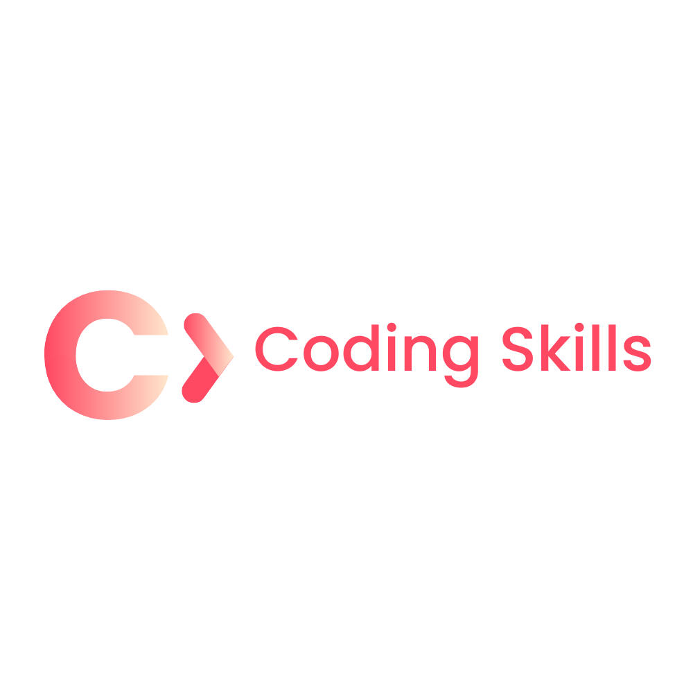

# MERN-LEARNING

Tracking Learning Activities

<a id="scroll-top"></a>

[![Contributors][contributors-shield]][contributors-url]
[![LinkedIn][linkedin-shield]][linkedin-url]

<!-- [![Forks][forks-shield]][forks-url]
[![Stargazers][stars-shield]][stars-url]
[![Issues][issues-shield]][issues-url]
[![MIT License][license-shield]][license-url] -->

<!-- PROJECT LOGO -->
<br />
<div align="center">
  <a href="https://github.com/madehuge">
    
  </a>

  <h3 align="center">Step By Step Guide To Learn Full Software Development</h3>

  <p align="center">
    You must check the following link to explore more!
    <a href="https://fullstack-skills.netlify.app/">View Projects</a>
  </p>
</div>

<!-- TABLE OF CONTENTS -->
<!-- <details>
  <summary>Table of Contents</summary>
  <ol>
    <li>
      <a href="#about-the-project">About The Project</a>
      <ul>
        <li><a href="#built-with">Built With</a></li>
      </ul>
    </li>
    <li>
      <a href="#getting-started">Getting Started</a>
      <ul>
        <li><a href="#prerequisites">Prerequisites</a></li>
        <li><a href="#installation">Installation</a></li>
      </ul>
    </li>
    <li><a href="#usage">Usage</a></li>
    <li><a href="#roadmap">Roadmap</a></li>
    <li><a href="#contributing">Contributing</a></li>
    <li><a href="#license">License</a></li>
    <li><a href="#contact">Contact</a></li>
    <li><a href="#acknowledgments">Acknowledgments</a></li>
  </ol>
</details> -->

<!-- ABOUT THE PROJECT -->

## About The Project

<!-- [![Product Name Screen Shot][product-screenshot]](https://example.com) -->

n today’s fast-paced tech world, continuous learning is key to staying relevant. This project is designed to help both freshers and experts dive deep into full-stack development in their spare time, whether you're balancing it with a job or school. It covers the entire spectrum of web development, from front-end technologies like HTML, CSS, and JavaScript, to building dynamic and responsive user interfaces with React. You’ll also gain hands-on experience with server-side technologies such as Node.js, databases like MySQL, and deploying applications to Cloud Servers.

Here's why:

- <strong>Comprehensive Learning Path</strong>: You'll gain hands-on experience with essential technologies like HTML, CSS, JavaScript, React, Node.js, MySQL, WordPress, and Cloud Servers. This well-rounded approach ensures you understand both front-end and back-end development.

- <strong>Real-World Applications</strong>: Each skill you learn is directly applicable to building real-world projects. By the end of the project, you’ll have a portfolio-ready, full-stack application that demonstrates your ability to create, deploy, and manage websites and web apps.

- <strong>Flexible Learning</strong>: Designed for those balancing jobs or schooling, this project can be completed at your own pace, in your spare time, allowing you to upgrade your skills without interrupting your current commitments.

- <strong>Industry-Relevant Skills</strong>: Full-stack developers are in high demand. Learning this set of technologies will give you a competitive edge, opening up career opportunities and improving your problem-solving and coding efficiency.

- <strong>Beginner-Friendly & Expert-Guided</strong>: Whether you're new to development or an expert refining your skills, this project offers resources and guidance at every level, allowing you to confidently move forward in your full-stack journey.

Not just that, you’ll explore the powerful CMS platform WordPress, which is widely used for web development, giving you a well-rounded skill set to tackle both custom builds and more traditional CMS-based solutions.

Whether you're a beginner aiming to break into the tech industry or an experienced developer looking to refine your skills, this project offers the flexibility to learn at your own pace. The goal is simple: empower you with practical, real-world skills that help you understand the entire web development process—from creating beautiful interfaces to deploying scalable applications. Join us, and take the next step in becoming a full-stack developer!

Start with `HTML->CSS->Javascript` and customize it for your own projects.

<p align="right">(<a href="#scroll-top">back to top</a>)</p>

### Technologies Used to Build and Explore the Project

This section should list any major frameworks/libraries used to bootstrap your project. Leave any add-ons/plugins for the acknowledgements section. Here are a few examples.

- [![Next][Next.js]][Next-url]
- [![React][React.js]][React-url]
- [![Vue][Vue.js]][Vue-url]
- [![Laravel][Laravel.com]][Laravel-url]
- [![Bootstrap][Bootstrap.com]][Bootstrap-url]
- [![JQuery][JQuery.com]][JQuery-url]
- [![WordPress][WordPress.org]][WordPress-url]
  <!-- - [![Angular][Angular.io]][Angular-url] -->
  <!-- - [![Svelte][Svelte.dev]][Svelte-url]  -->

<p align="right">(<a href="#scroll-top">back to top</a>)</p>

<!-- GETTING STARTED -->

## Getting Started

This is an example of how you may give instructions on setting up your project locally.
To get a local copy up and running follow these simple example steps.

### Prerequisites

This is an example of how to list things you need to use the software and how to install them.

- npm
  ```sh
  npm install npm@latest -g
  ```

<!-- ### Installation

_Below is an example of how you can instruct your audience on installing and setting up your app. This template doesn't rely on any external dependencies or services._ -->

<!-- 1. Get a free API Key at [https://example.com](https://example.com)
2. Clone the repo
   ```sh
   git clone https://github.com/github_username/repo_name.git
   ```
3. Install NPM packages
   ```sh
   npm install
   ```
4. Enter your API in `config.js`
   ```js
   const API_KEY = "ENTER YOUR API";
   ``` -->
<!-- 5. Change git remote url to avoid accidental pushes to base project
   ```sh
   git remote set-url origin github_username/repo_name
   git remote -v # confirm the changes
   ``` -->

<!-- <p align="right">(<a href="#scroll-top">back to top</a>)</p> -->

<!-- USAGE EXAMPLES -->

<!-- ## Usage

Use this space to show useful examples of how a project can be used. Additional screenshots, code examples and demos work well in this space. You may also link to more resources.

_For more examples, please refer to the [Documentation](https://example.com)_

<p align="right">(<a href="#scroll-top">back to top</a>)</p> -->

<!-- ROADMAP -->

## Roadmap

- [x] Add Changelog
- [x] Add back to top links
- [ ] Add Additional Templates w/ Examples
- [ ] Add "components" document to easily copy & paste sections of the readme
<!-- - [ ] Multi-language Support
  - [ ] Chinese
  - [ ] Spanish -->

See the [open issues](https://github.com/madehuge/MERN-LEARNING/issues) for a full list of proposed features (and known issues).

<p align="right">(<a href="#scroll-top">back to top</a>)</p>

<!-- CONTRIBUTING -->

## Contributing

Contributions are what make the open source community such an amazing place to learn, inspire, and create. Any contributions you make are **greatly appreciated**.

If you have a suggestion that would make this better, please fork the repo and create a pull request. You can also simply open an issue with the tag "enhancement".
Don't forget to give the project a star! Thanks again!

1. Fork the Project
2. Create your Feature Branch (`git checkout -b feature/AmazingFeature`)
3. Commit your Changes (`git commit -m 'Add some AmazingFeature'`)
4. Push to the Branch (`git push origin feature/AmazingFeature`)
5. Open a Pull Request

### Top contributors:

<a href="https://github.com/othneildrew/Best-README-Template/graphs/contributors">
  
</a>

<p align="right">(<a href="#scroll-top">back to top</a>)</p>

<!-- LICENSE -->

## License

Distributed under the MIT License. See `LICENSE.txt` for more information.

<p align="right">(<a href="#scroll-top">back to top</a>)</p>

<!-- CONTACT -->

## Contact

Manish Kumar Jangir - [@manish-jangir-a8b93691](https://www.linkedin.com/in/manish-jangir-a8b93691/) - madehuge@gmail.com

Project Link: [https://github.com/madehuge/](https://github.com/madehuge/)

<p align="right">(<a href="#scroll-top">back to top</a>)</p>

<!-- ACKNOWLEDGMENTS -->

## Acknowledgments

Use this space to list resources you find helpful and would like to give credit to. I've included a few of my favorites to kick things off!

- [Choose an Open Source License](https://choosealicense.com)
- [GitHub Emoji Cheat Sheet](https://www.webpagefx.com/tools/emoji-cheat-sheet)
- [Malven's Flexbox Cheatsheet](https://flexbox.malven.co/)
- [Malven's Grid Cheatsheet](https://grid.malven.co/)
- [Img Shields](https://shields.io)
- [GitHub Pages](https://pages.github.com)
- [Font Awesome](https://fontawesome.com)
- [React Icons](https://react-icons.github.io/react-icons/search)

<p align="right">(<a href="#scroll-top">back to top</a>)</p>

<!-- MARKDOWN LINKS & IMAGES -->
<!-- https://www.markdownguide.org/basic-syntax/#reference-style-links -->

[contributors-shield]: https://img.shields.io/github/contributors/madehuge/MERN-LEARNING.svg?style=for-the-badge
[contributors-url]: https://github.com/madehuge/MERN-LEARNING/pulse
[forks-shield]: https://img.shields.io/github/forks/othneildrew/Best-README-Template.svg?style=for-the-badge
[forks-url]: https://github.com/othneildrew/Best-README-Template/network/members
[stars-shield]: https://img.shields.io/github/stars/othneildrew/Best-README-Template.svg?style=for-the-badge
[stars-url]: https://github.com/othneildrew/Best-README-Template/stargazers
[issues-shield]: https://img.shields.io/github/issues/othneildrew/Best-README-Template.svg?style=for-the-badge
[issues-url]: https://github.com/othneildrew/Best-README-Template/issues
[license-shield]: https://img.shields.io/github/license/othneildrew/Best-README-Template.svg?style=for-the-badge
[license-url]: https://github.com/othneildrew/Best-README-Template/blob/master/LICENSE.txt
[linkedin-shield]: https://img.shields.io/badge/-LinkedIn-black.svg?style=for-the-badge&logo=linkedin&colorB=555
[linkedin-url]: https://www.linkedin.com/in/manish-jangir-a8b93691/
[product-screenshot]: images/screenshot.png
[Next.js]: https://img.shields.io/badge/next.js-000000?style=for-the-badge&logo=nextdotjs&logoColor=white
[Next-url]: https://nextjs.org/
[React.js]: https://img.shields.io/badge/React-20232A?style=for-the-badge&logo=react&logoColor=61DAFB
[React-url]: https://reactjs.org/
[Vue.js]: https://img.shields.io/badge/Vue.js-35495E?style=for-the-badge&logo=vuedotjs&logoColor=4FC08D
[Vue-url]: https://vuejs.org/
[Angular.io]: https://img.shields.io/badge/Angular-DD0031?style=for-the-badge&logo=angular&logoColor=white
[Angular-url]: https://angular.io/
[Svelte.dev]: https://img.shields.io/badge/Svelte-4A4A55?style=for-the-badge&logo=svelte&logoColor=FF3E00
[Svelte-url]: https://svelte.dev/
[Laravel.com]: https://img.shields.io/badge/Laravel-FF2D20?style=for-the-badge&logo=laravel&logoColor=white
[Laravel-url]: https://laravel.com
[Bootstrap.com]: https://img.shields.io/badge/Bootstrap-563D7C?style=for-the-badge&logo=bootstrap&logoColor=white
[Bootstrap-url]: https://getbootstrap.com
[JQuery.com]: https://img.shields.io/badge/jQuery-0769AD?style=for-the-badge&logo=jquery&logoColor=white
[JQuery-url]: https://jquery.com
[WordPress.org]: https://img.shields.io/badge/jQuery-0769AD?style=for-the-badge&logo=jquery&logoColor=white
[WordPress-url]: https://wordpress.org
